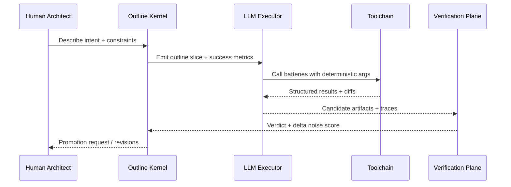
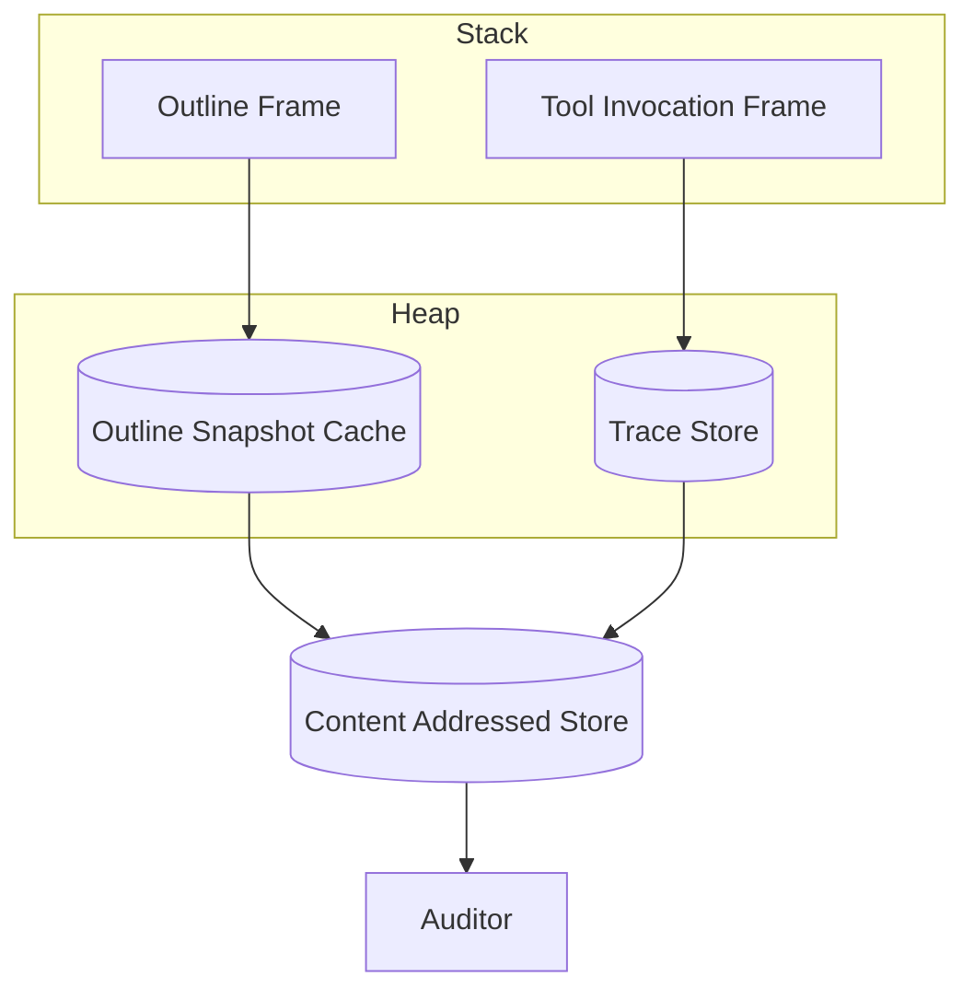
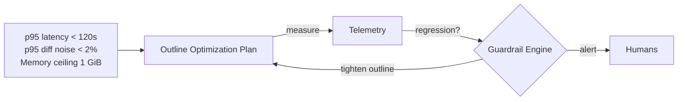

# Outline Driven Development: The whole new paradigm for the augumented LLM Code Agent workflows.

## `Vibe`s are too *shallow*, `Spec`s are too *complex*.
### Let there be the `outline`.

### And Indeed... Here it is!

- **Gemini CLI:** https://github.com/OutlineDriven/odin-gemini-cli-extension
  - Quick Install: `gemini extensions install https://github.com/OutlineDriven/odin-gemini-cli-extension`
- **Claude Code:** https://github.com/OutlineDriven/odin-claude-plugin
  - Quick Install: `claude plugin marketplace add OutlineDriven/odin-claude-plugin && claude plugin install odin-claude-plugin@odin-marketplace`
- **Codex CLI:** https://github.com/OutlineDriven/odin-codex-plugin

## Prerequisites

`lsd` | `ast-grep` | `ripgrep` | `fd` | MCPs

### Install Various Rust-based CLI Tools with cargo

#### Linux/macOS with cargo

**Install**

```bash
export RUSTFLAGS="-C target-cpu=native -C opt-level=3 -C codegen-units=1 -C strip=symbols"

cargo install lsd
cargo install ast-grep
cargo install ripgrep
cargo install fd-find
cargo install --locked bat
cargo install git-delta
cargo install tokei
cargo install --locked --bin jj jj-cli
```

#### Windows with cargo

**Install (run inside powershell)**
```powershell
$env:RUSTFLAGS="-C target-cpu=native -C opt-level=3 -C codegen-units=1 -C strip=symbols -C link-arg=/LTCG -C link-arg=/OPT:REF"

cargo install lsd
cargo install ast-grep
cargo install ripgrep
cargo install fd-find
cargo install --locked bat
cargo install git-delta
cargo install tokei
cargo install --locked --bin jj jj-cli
```

#### Uninstall CLI Tools

```
cargo uninstall ast-grep ripgrep fd-find bat git-delta tokei jj
```

### Setting Up MCPs

#### Crucial
ast-grep | context7 | sequentialthinking-tools | actor-critic-thinking | shannon-thinking

#### Additional
Time, Tavily, Exa, Ref-tools

## Outline-Driven Development Philosophy

> Deterministic scaffolds harness non-deterministic LLM creativity only when the outline stays the single source of truth and every downstream stage revalidates against it.

### Deterministic-with-Non-Deterministic-LLMs-by-Nature

- **Outline-as-assembly:** Human intent, compliance constraints, and architectural guardrails are compiled into a versioned outline whose hash becomes the control envelope for every agentic act.
- **LLM-as-module:** LLM calls are intentionally non-deterministic but bounded by the outline contract; disagreement between generated code and outline immediately halts or replays the step.
- **Telemetry feedback:** Execution traces, test verdicts, and rubric scores continuously feed back into the outline refinement loop to converge to a reproducible build.

**Control Envelope Checklist**

1. Canonical outline stored with content-addressable ID and time windowed approvals.
2. Every agent invocation receives a minimized delta (outline slice) plus explicit success metrics.
3. Determinism is measured: diff noise ≤ 2% between successive outline-conformant runs; higher variance triggers outline tightening before reattempting generation.

### Design-First / Best-Practices Batteries Included

- **Architecture-first:** Each outline must include interfaces, pre/postconditions, error domains, latency and memory budgets before code exists.
- **Tooling-first:** `lsd`, `ast-grep`, `ripgrep`, `fd`, LangGraph, and MCP stacks are treated as mandatory batteries so that structural edits, search, and orchestration are reproducible.
- **Quality gates:** Spec → outline → implementation is instrumented with lint/test/benchmark gates plus rollback hooks.
- **Observability:** Outline nodes ship tracing IDs and contract assertions so failures are attributable to outline leaves rather than opaque LLM conversations.

### Operational Contract

| Interface | Inputs | Outputs | Invariants | Error Modes |
| --- | --- | --- | --- | --- |
| Outline compiler | Human intent, regulatory constraints, acceptance tests | Canonical outline graph | Outline hash is monotonic; schema version strictly increases | Rejects on schema drift or missing invariants |
| Execution orchestrator | Outline slice, toolchain handles | Build/test artifacts, telemetry packets | Outline node IDs preserved end-to-end; tool invocations idempotent | Fails closed when telemetry missing or diff noise > threshold |
| Governance loop | Telemetry, human review, audits | Updated outline deltas, risk reports | Approvals recorded before deployment; audit log append-only | Raises incident if approvals lag or audit trail corrupt |

### Edge Cases & Adversarial Inputs

1. **Tool drift:** If a battery (e.g., `ast-grep`) is missing/obsolete, fall back to stub mode and block promotion until tool parity restored.
2. **Ambiguous intent:** Outline compiler enforces minimum specificity (actors, data boundaries, budgets) before allowing LLM execution.
3. **Spec regression:** Any outline delta that removes invariants triggers manual review and chaos-test replay.
4. **Long tail concurrency:** When asynchronous tools exceed budget, orchestrator escalates to serialized mode to preserve determinism.

### Verification Plan

- **Unit:** Outline schema lint + AST validation per node.
- **Integration:** Deterministic replay harness that rehydrates outlines and compares filesystem/output digests.
- **Property:** Fuzz differential between LLM-ready prompts and outline spec to prove no forbidden capability escapes.
- **Resilience:** Chaos hooks that kill tools mid-run to ensure orchestrator retries respect outline orderings.

### Diagram Suite

#### Architecture Δ

```mermaid
flowchart LR
    Intent[Human Intent] --> OutlineKernel[Outline Kernel]
    OutlineKernel -->|hash + schema| ControlPlane[Deterministic Control Plane]
    ControlPlane -->|delta contracts| LLMExecutors[LLM Executors]
    LLMExecutors --> Toolchain[Batteries (lsd/ast-grep/fd/...)]
    Toolchain --> Observability[Telemetry + Evidence Store]
    Observability -->|feedback| OutlineKernel
```

#### Data-flow Δ



#### Concurrency Δ

```mermaid
flowchart TD
    subgraph Outline Runtime
        Authoring[Authoring Thread]
        Executor[Executor Thread]
        Verifier[Verifier Thread]
    end
    Authoring -.≺-. Executor
    Executor -.≺-. Verifier
    Verifier -.≺-. Authoring
    Authoring -->|lock: Outline Mutex| SharedState[(Outline Store)]
    Executor -->|read-only snapshot| SharedState
    Verifier -->|append-only logs| Telemetry[(Telemetry Log)]
    Telemetry --> Governance[Governance Watchdog]
```

#### Memory Δ



#### Optimization Δ



#### Traceability Matrix

| Diagram | Goal | Associated Invariants |
| --- | --- | --- |
| Architecture Δ | Map outline-to-toolchain interfaces | Outline hash monotonicity |
| Data-flow Δ | Guarantee data never bypasses verification | Contract-bound IO only |
| Concurrency Δ | Preserve happens-before relationships | No circular waits; deadlock-free |
| Memory Δ | Ensure ownership + persistence model | Leak-free caches, append-only audit |
| Optimization Δ | Tie budgets to feedback loops | Regression triggers deterministic rollback |
